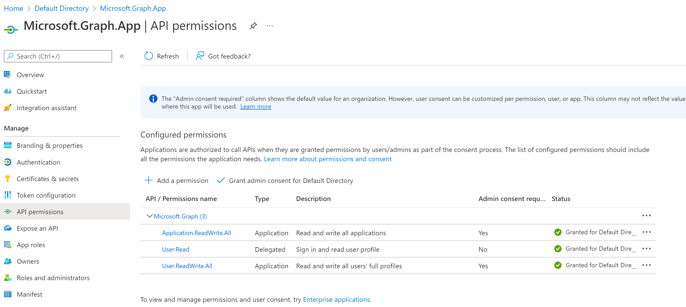
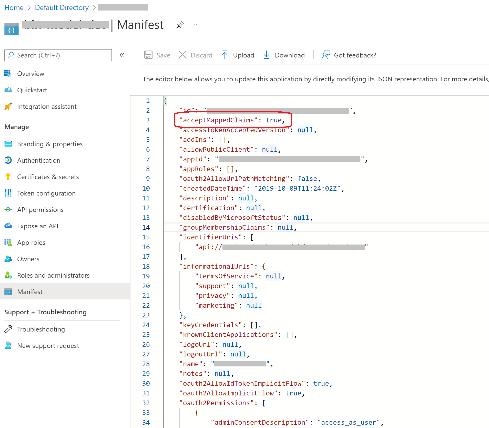
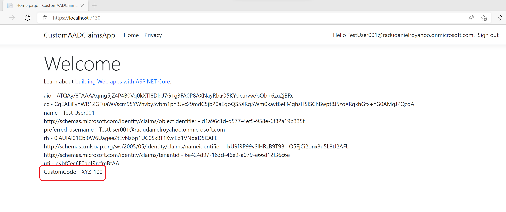

# Azure AD Custom Claims (aad-custom-claims)
Simple POC for adding custom attributes and claims in AAD.

## Pre-requisites

- PowerShell v5.1 or later
- AzureAD PowerShell module installed
- Azure AD tenant with admin access
- .NET 6.0 SDK
- Visual Studio 2019 / 2022 or Visual Studio Code

## Implementation

Follow these steps to add user custom attributes and map them as claims in AAD: 

### Create extension app and add custom attributes

The custom attributes require an extension app as a placeholder.

To minimise maintenance headache, it is recommended to use a single extension app in your tenant for all custom attributes.

However, depending on the security / business requirements you may decide to use multiple extension apps, for example one extension app for one business application.

The extension app is just a simple app registration in Azure AD.

The code below shows how to create an extension app (named `DeseExternalClaimsApp`) and a custom attribute (extension) called `CustomCode`, of type `String`, targeting `User` objects:

``` ps
$appName = 'DeseExternalClaimsApp'
$app = New-AzureADApplication -DisplayName $appName
New-AzureADServicePrincipal -AppId $app.AppId 

# create custom property
$propName = 'CustomCode'
$extensionProperty = New-AzureADApplicationExtensionProperty -ObjectId $app.ObjectId -Name $propName -DataType "String" -TargetObjects "User"
$extensionProperty
```

This extension or custom attribute will be used as custom claim in Azure AD token. There is no process to extract the  claim value during the authentication process. Azure AD will retrieve the value from the custom attribute stored against the logged-in user. 

### Create MS Graph App and give appropriate permissions

We will use MS Graph Api to update the custom attribute `CustomCode` against an existing user in Azure AD.

The console application `AADUpdater` uses `Microsoft.Graph` C# client library to call MS Graph REST APIs.

To register the MS Graph app, simply create an app registration in Azure AD portal and give it the correct MS Graph API permissions: `Application.ReadWrite.All`, `User.ReadWrite.All`:



### Update user attributes using MS Graph

Once registered, collect the required information and populate the `AADUpdater` application values in `appsettings.json` file:

 - Tenant - the tenant / directory name
 - TenantId - the corresponding tenantd ID
 - ClientId - the MS Graph Application ID
 - ExtensionAppClientId - the extension app Application ID
 
``` JSON
  "AzureAd": {
    "Tenant": "{tenant}",
    "TenantId": "***",
    "ClientId": "***",
    "ExtensionAppClientId": "***"
  }
```

`AADUpdater` CLI usage:
``` ps
aadupdater get|set|help --graph-app-secret <MS Graph App secret> --user-name <username> --attr-name <attr-name> [--attr-value <attr-value>]
```

The application has the following commands:
- get - returns the user custom attribute value
- set - sets value for provided custom attribute and user
- help - displays the usage help message

The application requires the following arguments:
- `--graph-app-secret` - the MS Graph app client secret
- `--user-name` - the user name to return or set data
- `--attr-name` - the custom attribute name (e.g. `CustomCode`)
-- `attr-value` - the new custom attribute value

Examples:

- get user custom attribute
``` ps
aadupdater get --graph-app-secret "***" --user-name TestUser001 --attr-name CustomCode
```

- set user custom attribute
``` ps
aadupdater set --graph-app-secret "***" --user-name TestUser001 --attr-name CustomCode --attr-value XYZ-100
```

### Map custom attributes to reuse in other app registration

So far we have registered the extension app, created the custom attribute / extension, and set its value against a particular user.

To be able to retrieve the custom attribute as claim, we need to map it as custom claim using a mapping policy.

There is no pre-requisite for the other app registration except a minor change in the application manifest to allow mapped claims (set `acceptMappedClaims` attribute to `true`):



The next step is to create the mapping policy to allow the other registered app to use the custom attribute / extension.

The full custom attribute / extension name or extension ID has the following pattern:

``` ps
extension_{modified guid}_{short name}
```

For our example, the `CustomCode` custom attribute will have a full name / ID similar to the one below (notice missing "-" from the guid):

``` ps
extension_0f8d12831f3d49c2a31c16a4296c87e7_CustomCode
```

To obtain the correct extension ID, we can use the `Get-AzureADApplicationExtensionProperty` PowerShell cmdlets.

Additional cmdlets such as `New-AzureADPolicy` and `Add-AzureADServicePrincipalPolicy` are used to create the policy and associate it with the other app service principal:

``` ps
$extensionAppName = 'DeseExternalClaimsApp'
$filter = "DisplayName eq '" + $extensionAppName + "'"
$schemaExtensionApp = (Get-AzureADApplication -Filter $filter)
 
$extensionName = 'CustomCode'
$extensionId = (Get-AzureADApplicationExtensionProperty -ObjectId $schemaExtensionApp.ObjectId).Where( { $_.Name.endsWith($extensionName)})[0].Name
$extensionId

 
$claimsMappingPolicy = @{
  ClaimsMappingPolicy = @{
    Version = 1
    IncludeBasicClaimSet = $true
    ClaimsSchema = @(
    @{
        Source = "User"
        ExtensionID = $extensionId
        JwtClaimType = $extensionName
     }
    )
  }
}

$otherAppName = '***'
$filter = "DisplayName eq '" + $otherAppName + "'"
$sp = (Get-AzureADServicePrincipal -Filter $filter) 

$policyName = 'CustomCode_Policy'
$policyDef = $claimsMappingPolicy | ConvertTo-Json -Depth 10 -Compress
$policy = New-AzureADPolicy -Type "ClaimsMappingPolicy" -DisplayName $policyName -Definition $policyDef
Add-AzureADServicePrincipalPolicy -Id $sp.ObjectId -RefObjectId $policy.Id

```

### Create test app to check the custom attributes for logged-in user

Once the policy created and associated with the other app SP, we can use it to retrieve the custom attribute / extension as claim in the Azure AD token.

For our test, we used a simple ASP.NET MVC Razor app (named `CustomAADClaimsApp`) with the following configuration (copy the required values from the "other" app registration blade in Azure AD portal):

``` JSON
  "AzureAd": {
    "Instance": "https://login.microsoftonline.com/",
    "Domain": "{tenant}.onmicrosoft.com",
    "TenantId": "***",
    "ClientId": "***",
    "CallbackPath": "/signin-oidc"
  },
```



---

# Resources

- Custom Claims in ASP.NET Core with Azure AD

https://rasmustherkelsen.wordpress.com/2019/12/09/custom-claims-in-azure-ad/
- Azure AD - add custom claim to access token

https://docs.microsoft.com/en-us/answers/questions/417758/azure-ad-add-custom-claim-to-access-token.html
- Customize claims emitted in tokens for a specific app in a tenant (PowerShell)

https://docs.microsoft.com/en-us/azure/active-directory/develop/active-directory-claims-mapping
- Azure AD – Adding Employeeid claims in Azure AD JWT token

https://www.devonblog.com/cloud/azure-ad-adding-employeeid-claims-in-azure-ad-jwt-token/
- Adding User Optional and Mapped Claims in the Azure AD Authentication Token

https://devblogs.microsoft.com/premier-developer/adding-user-optional-and-mapped-claims-in-the-azure-ad-authentication-token/
- Azure AD - Custom Claims in Access Tokens

https://docs.microsoft.com/en-us/answers/questions/135345/azure-ad-custom-claims-in-access-tokens.html
- Provide optional claims to your app

https://docs.microsoft.com/en-us/azure/active-directory/develop/active-directory-optional-claims
- Claims mapping policy type

https://docs.microsoft.com/en-us/azure/active-directory/develop/reference-claims-mapping-policy-type
